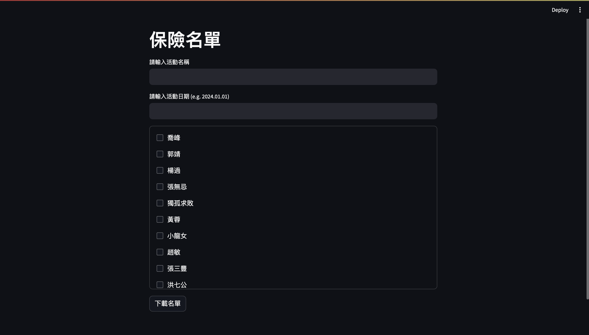

# Insurance List Maker

This is an insurance list making tool for people in Taiwan.  
The tool will create a database locally.



## Environment
```
poetry install
```

## Command Line Interface
```
python insurancer.py <list-of-participant-names>
```

## Web App UI
```
streamlit run app.py
```
> Creating entries is not supported so far for web app.